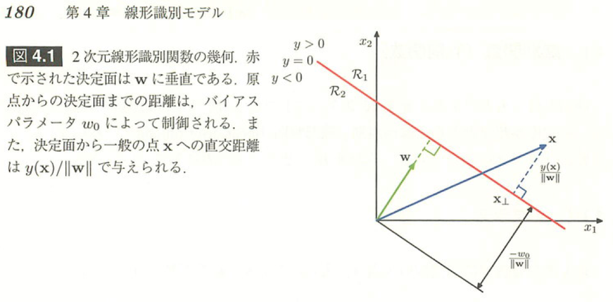

<!-- $theme: gaia -->

### Hands on Machine Learning with
###   Scikit-Learn &TensolFlow
## Chapter 5
#### Support Vector Machines

###### Created by Yusuke FUJIMOTO

---

# はじめに

*  この資料は「[Hands-On Machine Learning with Scikit-Learn and TensorFlow - O'Reilly Media](http://shop.oreilly.com/product/0636920052289.do) 」
を読んだ際の（主にソースコードに関する）簡単な解説を残したものです。
*  全部を解説したわけではないので注意
*  余裕があればソースコード周りの背景知識もまとめたい
*  何かあったら yukkyo12221222@gmail.com まで
---

# Chapter 5
# Support Vector Machines

---

## 今回のポイント
* SVM（Support Vector Machine）は超メジャーな分類・回帰モデル
* ここまで扱った回帰モデルの損失関数（コスト関数、エラー関数）
$$
\mathrm{cost}(\bold x) = \sum^T_{i=i}(f(\bold x_i) - \bold y_i)^2
$$
* でもこれは、$f(\bold x_i)$ と $\bold y_i$ の距離を表しているわけではない

---
* 分類境界（ここでは超平面という）と各データの距離（マージン）に着目しているのが SVM の特徴
* あとサポートベクトルと呼ばれる一部のデータ（1つとは限らない）で識別境界が決定されるので、疎なデータに強い
* また予測するときや新しくデータを追加したときは、サポートベクトルだけ見ればよいため効率的。

##### 数学的補足
*  (a, b) 行列（ベクトル）と (b, c) 行列（ベクトル）をかけると (a, c) 行列になる

---

* 識別境界 : $\omega^{\mathrm{T}} \bold x + b = 0$ 
  * 超平面からの距離 = $\omega$ の一次元ベクトルに写像しているだけ
### Large margin classification

* 特にコメントなし

---

### Sensitivity to feature scales
* 線形回帰モデルは、スケーリングをしないと精度に大きく影響した
* SVM ではスケールの変更前後で大きく変わらない（教科書確認）
* 
---

### Sensitivity to outliers
外れ値に対してどのように動作するのか確認する
* 外れ値が片方のクラスの散布に食い込んでいる場合
  * 線形分離不可能になっている
* 外れ値が片方のクラスの散布に非常に近い場合
  * 本来の境界より、片方のクラスに寄ったものになっている
---

### Large margin vs margin violations
マージンを大きくとるかマージン違反を許すか？？？（該当箇所を読む）
* 実問題では綺麗に線形分離できるとは限らない
  * 綺麗に分離できる場合しか境界を引けない（マージン違反を決して許さない） = ハードマージンSVM
  * マージン違反したデータに対してはペナルティを与えて、一応境界が引けるようにした SVM = ソフトマージンSVM
  * LinearSVC はソフトマージンSVM。実は。

---

* LinearSVCのオプションには `C` がある。これが正則化の強さ（線形回帰モデルにおける $\alpha$ の逆数にあたる）を表す。大きいほど強い。
* 小さいほどマージン違反を許し、大きいほど許さない
  * $C = \infty$ の場合にハードマージンSVMと等価
  * 先ほどの 「Sensitivity...」 では $C = 10^9$ となっており実質ハードマージンSVM
* $C=1$ の場合と $C=100$ の場合でどう変わるのか確認する。

---

### Non-linear classification
非線形な分離はできないのか？　→　できる
* higher_dimensions_plot : 一次元では線形分離ができなかったけど、二次元に射影したら線形分離できるようになった
* Chapter 4 では polynomial feature で高次元特徴空間に射影して線形分離した
  * polynomial svc
* 他のカーネルとして代表的なもの: RBFカーネル
  *  gamma が小さいほど単純な境界になる
---

### Regression
* クラス分類だけでなく回帰もできる。
* 予測誤差を最小化するような超平面（線）を求める
* $\epsilon$ は超平面からの距離の内エラーを許容する広さを示す
  *  実際 $\epsilon = 1.5$ の方が帯が広いのが分かる

---

### Under the hood
* 学習や超平面の内訳。理論寄りのお話。
* SVM ではマージンを最小化するようなモデルを学習したい。
* つまりSVM における学習とは、マージン関数を最小化したいという最適化問題を解くことと同じ。
* また、最適化問題を解くにあたって、マージン関数をそのまま扱うのではなく、双対問題という、答えが同じになるけどより簡単に解けそうな問題に落とし込む

---
##### SVM で最適化したい対象
* マージン（境界に一番近い点から境界までの距離）を最大化したい
* 超平面 $f(\bold x ) = \space \bold w^T \bold x + b = 0$ から、点 $\bold a$ までの距離は $\frac{|f(\bold a)|}{\| \bold w\|}$ で与えられる（次ページ参照）
* よって次の問題を解くことと同じ
$$
\text{arg max}_{\bold w , b}
\left(
\frac{1}{\|\bold w\|} \text{min}_n [t_n(\bold w^T \bold x + b)]
\right)
$$
*  $t_n$ はラベル（負なら-1、正なら1）

---

$\bold w \rightarrow k \bold w$、$b \rightarrow kb$ としても超平面からの距離 $\frac{|f(\bold x)|}{\|\bold w\|}$ は変わらないので、最も近い点について以下を成立させて良い

$$
t_n(\bold w^T \bold x + b) = 1
$$

よって先程の問題は下記のようになる

$$
\text{arg max}_{\bold w , b}
\left(
\frac{1}{\|\bold w\|}
\right)
$$

$$
\Rightarrow \text{arg min}_{\bold w, b} \space \frac{1}{2} \bold w^T \bold w
$$

$\frac{1}{2}$ はあとで計算が楽になるためつけてる

---
##### 補足：超平面からの距離
* ある点 $\bold x_0$ と平面 $f(\bold x ) = \space \bold w^T \bold x + b = 0$ との距離を考える。
* 点 $\bold x_0$ に $k$ 倍にした $\frac{\bold w}{|\bold w|}$ を足すと平面にぶつかる。この点を $\bold z$ とする。また $\frac{\bold w}{|\bold w|}$ は大きさ $1$ であることから、求める距離は $|k|$ である。
* 点 $\bold z$ は平面上の点なので $f(\bold z)=0$
---

* よって以下の式が成り立つ
$$f(\bold z) = f(\bold x_0 + k \frac{\bold w}{|\bold w|})$$

$$
= \bold w^T \bold x_0 + k\frac{\bold w^T \bold w}{|\bold w|} + b
= \bold w^T \bold x_0 + b + k|\bold w| = 
$$

$$
= f(\bold x_0) + k|\bold w| = 0
$$

$$
\Rightarrow |k| = \frac{f(\bold x_0)}{|\bold w|}
$$
※ $\bold w^T \bold w = |\bold w|^2$ 

---
##### 補足：超平面からの距離（PRML上より引用）

---

##### ハードマージン線形SVM分類の最適化対象
* 目的関数
$$
\text{minimize}_{(\bold w , b)} \space \frac{1}{2} \bold w^T \bold w
$$

* 制約条件
$$
\space t^{(i)} \left( \bold w^T \bold x^{(i)} + b \right) \geq 1 \space \text{for} \space i = 1, 2, \cdots, m
$$

---

##### ソフトマージン線形SVM分類の最適化対象
* 目的関数
$$
\text{minimize}_{(\bold w , b, \zeta)}
\space
\frac{1}{2} \bold w^T \bold w +
C\sum^m_{i=1}\zeta^{(i)}
$$

* 制約条件
$$
\space t^{(i)} \left( \bold w^T \bold x^{(i)} + b \right) \geq 1 - \zeta^{(i)}
$$

$$
\text{and} \space \zeta^{(i)} \geq 0
$$
$$
\text{for} \space i = 1, 2, \cdots, m
$$

---

##### 凸二次計画問題

* 目的関数: $\bold {min} \space \frac{1}{2} \bold p^{T} \bold {Hp} \space +    \space \bold f^{T}\bold p$
* 制約条件: $\bold {Ap} \leq \bold b$
  * $\bold p$ : $n_p$（パラメータ数）次元のベクトル
  * $\bold H$ : $n_p \times n_p$ 行列
  * $\bold f$ : $n_p$（パラメータ数）次元のベクトル
  * $\bold A$ : $n_c \times n_p$ 行列。$n_c$ は制約の数
  * $\bold b$ : $n_c$ 次元のベクトル

---
##### ハードマージンSVMにおける各パラメータについて
* $n_p = n + 1$　$n$ は特徴の数、$+1$ はバイアス分
* $n_c = m$　$m$ はトレーニングデータの数
* $\mathrm{H}$ は単位行列。ただし一番左上の要素は $0$
  * バイアス分を無視するため
* $\bold f = \bold 0$、$\bold b = \bold 1$
* $\bold a^{(i)} = -t^{(i)} \dot{\bold x}^{(i)}$
  * $\dot{\bold x}^{(i)}$ は $i = 0$（バイアス分）のときだけ $\bold 1$ で、他の場合は $\bold x^{(i)}$ と同じ

---
##### 双対問題について
* 主変数がたくさんあって制約条件が少なければ、双対問題の方が変数が少なくできる
* すると、主問題より楽に解ける可能性が高い
* 双対問題の方はよく手に入るソルバーで解けるらしい

$$
\text{minimize}_{\alpha}
\space
\frac{1}{2}
\sum^m_{i=1}\sum^m_{j=1}
\alpha_i \alpha_j t_i t_j \bold x^T_i \bold x_j \space
-
\sum^m_{i=1}\alpha_i
$$

$$
\text{subject to: } \space
\alpha_i \geq 1
\space
\text{for}
\space
i = 1,2,\cdots,m
$$

---
##### 双対問題を解いたあと
以下のようにして $\bold w$ と $b$ を計算できる。ハットは推定値などの意味を含む

$$
\hat{\bold w} = \sum^m_{i=1}\hat{\alpha_i} t_i \bold x_i
$$

$$
\hat{b} = \frac{1}{n_S} \sum_{i \in S}
\left(
1 -
t_i ( \hat{\bold w}^T \bold x_i)
\right)
$$

* $S$ は $\hat{\alpha}_i > 0$ となる $i$ の集合。すなわちサポートベクトル一覧を表す。また $n_S = |S|$。その他は 0

---

##### カーネル SVM における予測（判定）

$$
h_{\hat{\bold w}, \hat{b}}(\phi(\bold x_{new})) = 
\hat{\bold w}^T \phi(\bold x_{new}) 
\space + \hat{b}
$$

$$
=
\left(
\sum^m_{i=1}\hat{\alpha}_i t_i
\phi(\bold x_i)

\right)^T \phi(\bold x_{new})
\space+ \hat{b}
$$

$$
=
\sum^m_{i=1}\hat{\alpha}_i t_i
\left(
\phi(\bold x_i)^T
\phi(\bold x_{new})
\right)
\space
+
\hat{b}
$$

$$
=
\sum_{i \in S}\hat{\alpha}_i t_i
K(\bold x_i, \bold x_{new})
\space
+
\hat{b}
$$

サポートベクトルとカーネル関数で予測できる

---
##### カーネル使うと何が嬉しいの？
* 普通に高次元に変換してそのまま解けば良いのでは？
  * すごく大きい次元（例えば無限次元）に変換してから計算するのは無理
  * でも高次元上での **内積の値** であれば比較的簡単に計算できる場合が多い
  * SVM を学習する上で解きたい最適化問題では、最終的には高次元上でのベクトルは扱わず、 **内積の値** だけ扱っていた →　カーネルトリック
  * 高次元のベクトルを直接扱わずに高次元上での計算ができた！

---
* 各カーネルとその中身

|カーネル|数式|
|----------------:|---|
|Linear|$K(\bold a, \bold b) = \space \bold a^T \cdot \bold b$|
|Polynomial|$K(\bold a, \bold b) = \space \left( \gamma \bold a^T \cdot \bold b + r\right)^d$|
|Gaussian RBF|$K(\bold a, \bold b) = \space \exp \left( -\gamma \| \bold a - \bold b\|^2 \right)$|
|Sigmoid|$K(\bold a, \bold b) = \space \tanh \left( \gamma \bold a^T \cdot \bold b + r \right)$|

* $\gamma$ と $r$ は違うので注意
---

### Hinge loss
誤差関数のひとつ。引数が正の数ならそのまま出力し、それ以外なら 0 を出力する。
大きい意味はないので説明は省略。

---

### Extra material 
##### Linear SVM classifier implementation using Batch Gradient Descent
そのうち追記する

---

### Extra material questions
* 1: SVM の基本的な考えは？
  * マージン（超平面とデータの距離）を最大化
* 2: サポートベクトルって何？
  * 超平面から一番近い各クラスのデータ（ベクトル）。それ以外のベクトルは超平面の決定に関与しない
* 3: SVM に入力するときはどうしてスケーリングが大事なのか
  * SVM はなるべく広い帯を作ろうとするので、スケーリングがされていないと小さい特徴を無視する傾向があるため
---

* 4: SVM 分類器はデータの分類時に、確信度スコアのようなものを出力できるか。
  * できる。ただし直接確率に変換できるわけではない。Scikit-learn で SVM モデルを構築する際に `probability = True` を指定すると、学習後に SVM のスコアに対してロジスティック回帰によって確率を測定する。
  * `predict_proba()` や `predict_log_proba()` 
---

* 5: データ数が100万、特徴数が数百のときには、主問題と双対問題のどちらを解くべきか？
  * まずカーネル SVM は双対問題しか使えない
  * よって線形 SVM の場合のみ考える
    * この場合は主問題を解く。
    * データの特徴次元よりデータ数のほうがはるかに大きいため

---

* 6: もし RBF カーネルSVM をトレーニングしたときに、訓練データに underfit していた場合は、$\gamma$ を増やすべきか、減らすべきか？
  * 正則化が強すぎるので、これを弱めるためには gamma や C を増やす

* 7: 既存のソルバーを使ってソフトマージン 線形 SVM を解く際は、二次凸問題のパラメータをどのように設定するべきか？
  * よくわからないので省略
---

*  8: 線形分離可能なデータを LinearSVC で学習する。その場合同じデータセットを SVC と SGDClassifier で学習させると、大体同じモデルが得られることを確認せよ
  * notebook

---

* 9: SVM 分類器で MNIST データセットを学習する。SVM は二値分類器なので、10 個のクラスを分類するために one-versus-all 分類器を使わなければならない。あなたはプロセスを速くするために小さい評価データセットを使ってハイパーパラメータを調整したい。どのようにやるか？そして精度はどうなるか？
  * 次ページの方法を試す

---
1. 線形SVM（LinearSVC）でそのまま学習　→ 0.8263（悪い）
2. 上記のまま、データをスケーリング　→　0.9224（まあまあ）
3. 上記のデータのまま量は6分の1にして、RBFカーネルSVM（SVC）を適用　→　0.9462
4. 上記について、gamma と C はデフォルトのままだったので、 範囲を決めてデータ数 1000 で randomized search を行って良いパラメータを探す。その後全データで学習した　→　0.9710 （悪くない）。ただしテストデータだと 0.9997 なので、やや overfitting 気味か。
---

* 10: California housing dataset (Chapter 2 で扱った) に対し、サポートベクター回帰を使ってモデルを構築して学習させよ
  * notebook 
---

### Exercise solutions