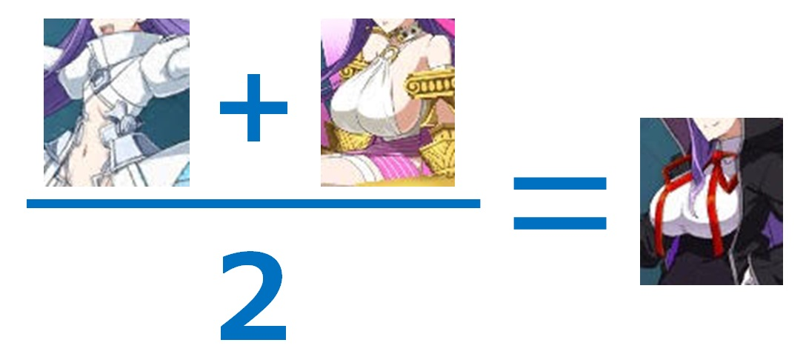

<!-- $theme: gaia -->

### Hands on Machine Learning with
###   Scikit-Learn &TensolFlow
## Chapter 5
#### Support Vector Machines

###### Created by Yusuke FUJIMOTO

---

# はじめに

*  この資料は「[Hands-On Machine Learning with Scikit-Learn and TensorFlow - O'Reilly Media](http://shop.oreilly.com/product/0636920052289.do) 」
を読んだ際の（主にソースコードに関する）簡単な解説を残したものです。
*  全部を解説したわけではないので注意
*  余裕があればソースコード周りの背景知識もまとめたい
*  何かあったら yukkyo12221222@gmail.com まで
---

# Chapter 5
# Support Vector Machines

---

## 今回のポイント
* SVM（Support Vector Machine）は超メジャーな分類・回帰モデル
* ここまで扱った回帰モデルの損失関数（コスト関数、エラー関数）
$$
\mathrm{cost}(\bold x) = \sum^T_{i=i}(f(\bold x_i) - \bold y_i)^2
$$
* でもこれは、$f(\bold x_i)$ と $\bold y_i$ の距離を表しているわけではない

---
* 分類境界（ここでは超平面という）と各データの距離（マージン）に着目しているのが SVM の特徴
* あとサポートベクトルと呼ばれる一部のデータ（1つとは限らない）で識別境界が決定されるので、疎なデータに強い
* また予測するときや新しくデータを追加したときは、サポートベクトルだけ見ればよいため効率的。
---

* 識別境界 : $\omega^{\mathrm{T}} \bold x + b = 0$ 
  * 超平面からの距離 = $\omega$ の一次元ベクトルに写像しているだけ
### Large margin classification

* 特にコメントなし

---

### Sensitivity to feature scales
* 線形回帰モデルは、スケーリングをしないと精度に大きく影響した
* SVM ではスケールの変更前後で大きく変わらない（教科書確認）
* 
---

### Sensitivity to outliers
外れ値に対してどのように動作するのか確認する
* 外れ値が片方のクラスの散布に食い込んでいる場合
  * 線形分離不可能になっている
* 外れ値が片方のクラスの散布に非常に近い場合
  * 本来の境界より、片方のクラスに寄ったものになっている
---

### Large margin vs margin violations
マージンを大きくとるかマージン違反を許すか？？？（該当箇所を読む）
* 実問題では綺麗に線形分離できるとは限らない
  * 綺麗に分離できる場合しか境界を引けない（マージン違反を決して許さない） = ハードマージンSVM
  * マージン違反したデータに対してはペナルティを与えて、一応境界が引けるようにした SVM = ソフトマージンSVM
  * LinearSVC はソフトマージンSVM。実は。

---

* LinearSVCのオプションには `C` がある。これが正則化の強さ（線形回帰モデルにおける $\alpha$ の逆数にあたる）を表す。大きいほど強い。
* 小さいほどマージン違反を許し、大きいほど許さない
  * $C = \infty$ の場合にハードマージンSVMと等価
  * 先ほどの 「Sensitivity...」 では $C = 10^9$ となっており実質ハードマージンSVM
* $C=1$ の場合と $C=100$ の場合でどう変わるのか確認する。

---

### Non-linear classification
非線形な分離はできないのか？　→　できる
* higher_dimensions_plot : 一次元では線形分離ができなかったけど、二次元に射影したら線形分離できるようになった
* Chapter 4 では polynomial feature で高次元特徴空間に射影して線形分離した
  * polynomial svc
* 他のカーネルとして代表的なもの: RBFカーネル
  *  gamma が小さいほど単純な境界になる
---

### Regression
* クラス分類だけでなく回帰もできる。
* 予測誤差を最小化するような超平面（線）を求める
* $\epsilon$ は超平面からの距離の内エラーを許容する広さを示す
  *  実際 $\epsilon = 1.5$ の方が帯が広いのが分かる

---

### Under the hood
* 学習や超平面の内訳。理論寄りのお話。
* SVM ではマージンを最小化するようなモデルを学習したい。
* つまりSVM における学習とは、マージン関数を最小化したいという最適化問題を解くことと同じ。
* また、最適化問題を解くにあたって、マージン関数をそのまま扱うのではなく、双対問題という、答えが同じになるけどより簡単に解けそうな問題に落とし込む

---
##### SVM で最適化したい対象
* マージン（境界に一番近い点から境界までの距離）を最大化したい

---

##### ハードマージン線形SVM分類の最適化対象
* マージンを最大化したい →　
* 目的関数
$$
\text{minimize}_{(\bold w , b)} \space \frac{1}{2} \bold w^T \bold w
$$

* 制約条件
$$
\space t^{(i)} \left( \bold w^T \bold x^{(i)} + b \right) \geq 1 \space \text{for} \space i = 1, 2, \cdots, m
$$

---

##### 凸二次計画問題

* 目的関数: $\bold {min} \space \frac{1}{2} \bold p^{T} \bold {Hp} \space +    \space \bold f^{T}\bold p$
* 制約条件: $\bold {Ap} \leq \bold b$
  * $\bold p$ : $n_p$（パラメータ数）次元のベクトル
  * $\bold H$ : $n_p \times n_p$ 行列
  * $\bold f$ : $n_p$（パラメータ数）次元のベクトル
  * $\bold A$ : $n_c \times n_p$ 行列。$n_c$ は制約の数
  * $\bold b$ : $n_c$ 次元のベクトル

---
##### ハードマージンSVMにおける各パラメータについて
* $n_p = n + 1$　$n$ は特徴の数、$+1$ はバイアス分
* $n_c = m$　$m$ はトレーニングデータの数
* $\mathrm{H}$ は単位行列。ただし一番左上の要素は $0$
  * バイアス分を無視するため
* $\bold f = \bold 0$、$\bold b = \bold 1$
* $\bold a^{(i)} = -t^{(i)} \dot{\bold x}^{(i)}$
  * $\dot{\bold x}^{(i)}$ は $i = 0$（バイアス分）のときだけ $\bold 1$ で、他の場合は $\bold x^{(i)}$ と同じ

---
* ※ (a, b) 行列（ベクトル）と (b, c) 行列（ベクトル）をかけると (a, c) 行列になる
  * 目的関数は 1 次元の値になることが分かる
* 各カーネルとその中身

|カーネル|数式|
|----------------:|---|
|Linear|$K(\bold a, \bold b) = \space \bold a^T \cdot \bold b$|
|Polynomial|$K(\bold a, \bold b) = \space \left( \gamma \bold a^T \cdot \bold b + r\right)^d$|
|Gaussian RBF|$K(\bold a, \bold b) = \space \exp \left( -\gamma \| \bold a - \bold b\|^2 \right)$|
|Sigmoid|$K(\bold a, \bold b) = \space \tanh \left( \gamma \bold a^T \cdot \bold b + r \right)$|

* $\gamma$ と $r$ は違うので注意

---
##### カーネル使うと何が嬉しいの？
* 普通に高次元に変換してそのまま解けば良いのでは？
  * すごく大きい次元（例えば無限次元）に変換してから計算するのは無理
  * でも高次元上での **内積の値** であれば比較的簡単に計算できる場合が多い
  * SVM を学習する上で解きたい最適化問題では、最終的には高次元上でのベクトルは扱わず、 **内積の値** だけ扱っていた →　カーネルトリック
  * 高次元のベクトルを直接扱わずに高次元上での計算ができた！

---

### Hinge loss

### Extra material

### Exercise solutions